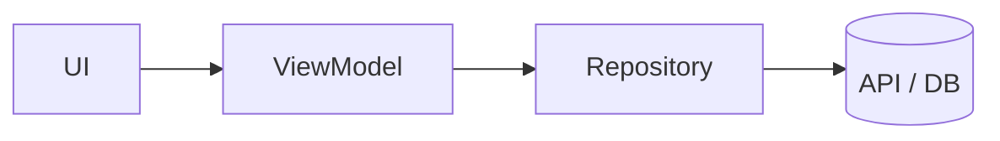

# Project name

> One line: what this does and who it's for.

<!-- Badges: CI · release · live link -->

## Problem — why this exists
What hurt before this project? What did people do instead, and why wasn't that good enough?

## Demo
<!-- GIF / screenshot / video link -->

## Architecture


## Tech stack
-

## Key decisions & trade-offs
| Decision | Why | What I gave up |
|---|---|---|
| | | |

## Numbers
<!-- startup ms, build time, eval score, latency… measured, never guessed -->

## How to run
```bash
# steps
```

## What I learned
-

## Roadmap
- [ ]
